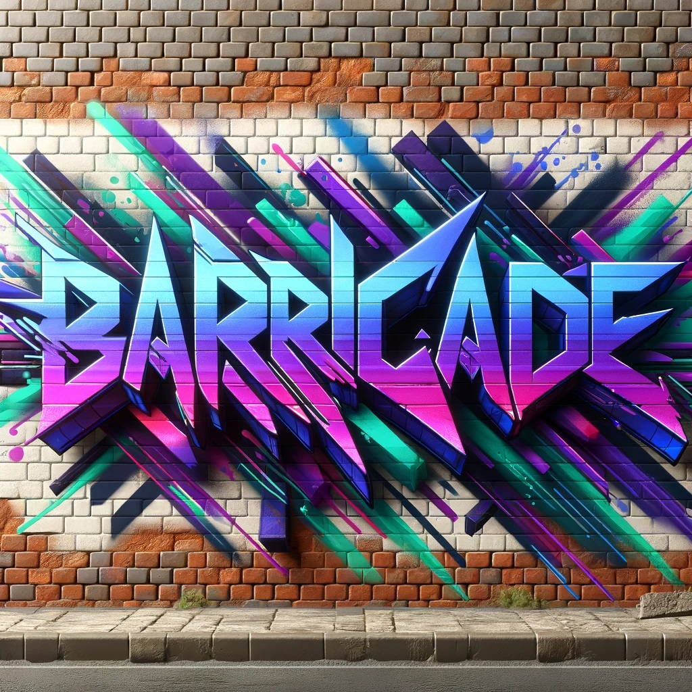

# Welcome to My GitHub Profile!

## 👋 Hi there, 
I'm 90Barricade93 a.k.a Raymond! I recently embarked on my journey in the IT field and am eager to further develop my skills and knowledge. My background in software development and AI architecture, reinforced by completing over 40 courses related to data and AI, has ignited my passion for technology.

continious learner since 2023 🤓
##   What I'm Looking For:
- **Mentorship**: I would love to learn from experienced professionals. If you're interested in mentoring, please let me know!
- **Internships**: I'm seeking opportunities to gain hands-on experience and contribute to meaningful projects.
- **Entry-Level Positions**: Ready to officially kickstart my career, I am looking for full-time opportunities where I can apply my skills and continue to grow.

## About Me:
### My Expertise:
- **Languages**: Proficient in Python, HTML, CSS, and familiar with C# and R.
- **AI and Data Analysis**: Deeply interested in machine learning, neural networks, and data visualization techniques.
- **Software Development**: Committed to developing robust, scalable software that enhances user experiences and business operations.
- **Cloud Technologies**: Actively exploring cloud solutions to improve system efficiency and scalability.

**Interests**: 
  - **Artificial Intelligence (AI)**: Passionate about the potential of AI to transform industries and improve lives.
  - **Software Development (SD)**: Engaged in building robust and scalable software solutions.
  - **Cloud Technologies**: Exploring cloud platforms and services to optimize computing resources and scalability.
  - **Flight Simulation**: An avid enthusiast of flying in MSFS2020 using VR with single piston engine aircraft (VFR), enjoying the challenge and precision of visual flight rules navigation.

## Goals:
- **Career**: Aspire to become a T-shaped professional in AI/software development, with in-depth knowledge in specialized areas while remaining broadly competent in the industry.
- **Personal**: To become fluent speaker of English, and to contribute to meaningful projects.
- **Community**: To be part of a welcoming and inclusive community of learners and professionals.

### 👀 Have a look at my dataCamp portfolio:
- [dataCamp](https://www.datacamp.com/portfolio/raymonddevries76)

## 🔗 Connect with me! 
Feel free to reach out here on GitHub or via;
- [linkedin](https://www.linkedin.com/in/raymond-de-vries76/)
- [twitter](https://x.com/Vries_de_R)

-------

[⬆️ Back to Top ⬆️](#readme-top)

